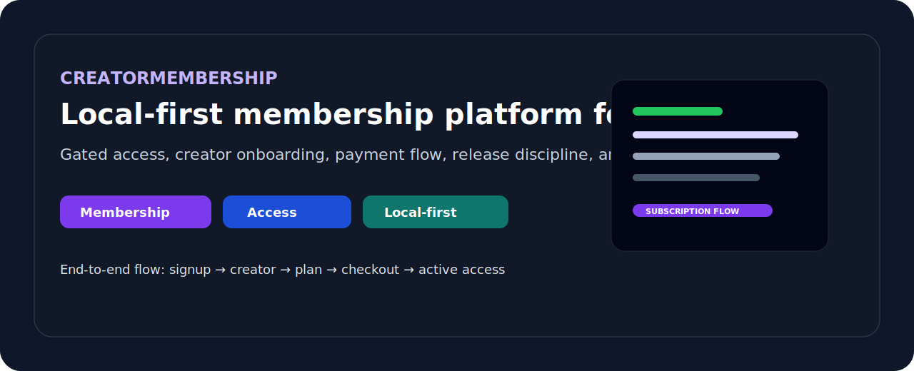

# CreatorMembership

<p align="center">
  
</p>

Local-first creator membership platform for gated digital products, access control, and production-minded delivery.

## What This Project Is

`creatormembership` is a monorepo for creators who need a practical way to sell access, manage members, and deliver protected content without relying too heavily on fragile external systems.

It is built around a simple product direction:

- creators need ownership
- buyers need a smooth access flow
- operators need release confidence
- the system needs to stay usable under local constraints

## Product Intent

This repository is not just a UI demo.

It is designed to support a real end-to-end membership flow:

- signup
- creator onboarding
- plan setup
- checkout and callback handling
- active subscription state
- gated content access

## Why It Matters

Many creator tools are dependency-heavy, expensive, or not resilient enough for constrained environments.

This project focuses on:

- local-first delivery
- controlled infrastructure
- governance-aware release flow
- practical monetization for creators

## Portfolio Value

This repository demonstrates:

- product and platform thinking
- monorepo delivery across API and web
- operational scripting and release readiness
- access control, payment flow, and membership lifecycle design

## Current Status

Verified locally as documented in project status:

- core flow has been validated through smoke coverage
- quality gates are green in the documented workflow
- phased backlog is maintained and automation-backed

Relevant references:

- `docs/PROJECT_STATUS.md`
- `docs/ROADMAP_PHASED.md`

## Stack

- pnpm workspace monorepo
- `apps/web`: Next.js, React, TypeScript
- `apps/api`: Fastify, TypeScript
- PostgreSQL-backed application flows
- release, smoke, and governance scripts at repo root

## Quick Start

### Prerequisites

- Node.js 20+
- `pnpm`
- PostgreSQL

### Install

```bash
pnpm install
```

### Run API

Set `DATABASE_URL`, then:

```bash
pnpm api:dev
```

### Run Web

```bash
pnpm dev
```

### Local-first stack helpers

```bash
pnpm local:stack:start
pnpm local:stack:status
pnpm local:stack:stop
```

Optional local proxy helpers:

```bash
pnpm local:proxy:start
pnpm local:proxy:status
pnpm local:proxy:stop
```

Full local automation:

```bash
pnpm run:local:full
```

## Quality and Verification

Core quality path:

```bash
pnpm docs:validate
pnpm lint
pnpm typecheck
pnpm local-first:scan
pnpm test
pnpm build
```

Broader verification:

```bash
pnpm test:integration
pnpm test:e2e
pnpm smoke:mock-payment
pnpm runtime:health:report
```

## Environment Highlights

See `.env.example` and `apps/api/.env.example`.

Important variables include:

- `DATABASE_URL`
- `PUBLIC_BASE_URL`
- `JWT_ACCESS_SECRET`
- `JWT_REFRESH_SECRET`
- `SESSION_SECRET`
- `PAYMENT_GATEWAY`
- `PAYMENT_GATEWAY_BASE_URL`
- `PAYMENT_GATEWAY_WEBHOOK_SECRET`
- `CONTENT_STORAGE_ROOT`

## Operations and Release Flow

- phased production scripts: `production:phase-a` through `production:phase-g`
- release evidence and go/no-go scripts are available at repo root
- rollback validation is part of the release discipline
- runtime health reporting is included for operational visibility

## Who This Is For

- creators selling premium access or digital products
- teams who need a self-controlled membership workflow
- operators who care about release confidence and local resilience

## Positioning

If you need a production-minded membership platform with local-first priorities, this project shows how I approach product architecture, gated access, release workflows, and operational control in one system.
